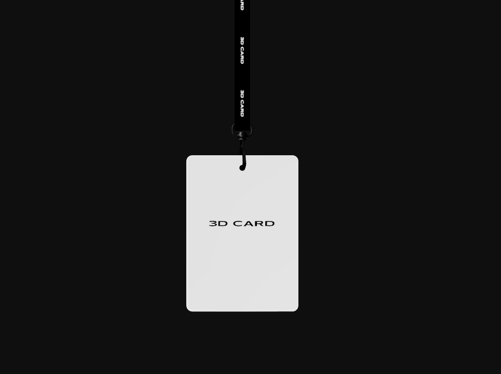

# lanyard-3d

<div align="center">
  
</div>

Experimento visual em 3D que simula um crachá pendurado por uma fita, com comportamento físico em tempo real.

Você pode clicar e puxar o crachá para baixo (ou para outras direções) e soltar para ver a reação natural da estrutura, como balanço, inércia e amortecimento.

## O que o projeto demonstra

- Simulação de física com juntas entre segmentos (efeito de fita/cordão).
- Interação por arrasto (drag) no objeto 3D.
- Renderização em tempo real com iluminação de estúdio.
- Uso de modelo GLB e textura aplicada na fita.

## Stack e bibliotecas envolvidas

### Núcleo da experiência

- `next`, `react`, `react-dom`: base da aplicação web.
- `three`: engine 3D usada por baixo dos panos.
- `@react-three/fiber`: integração declarativa do Three.js com React.
- `@react-three/drei`: utilitários para cena 3D (GLTF, texturas, ambiente e luzes).
- `@react-three/rapier`: física em tempo real (corpos rígidos e juntas).
- `meshline`: renderização da fita/linha com geometria própria.

### Bibliotecas instaladas, mas não utilizadas no código atual

- `framer-motion`
- `framer-motion-3d`
- `@studio-freight/lenis`
- `leva`

Se quiser, você pode remover essas dependências para reduzir o bundle e simplificar o projeto.

## Como rodar localmente

```bash
npm install
npm run dev
```

Abra `http://localhost:3000` no navegador.

## Estrutura principal

- `app/page.tsx`: ponto de entrada da página.
- `components/band/App.js`: cena 3D, física, interação e renderização do crachá.
- `components/band/index.css`: container responsivo do canvas.
- `public/assets/`: modelo `.glb` e textura da fita.

## Sugestão de descrição curta (GitHub)

Teste de componentes 3D com simulação física de crachá interativo: arraste e solte para ver o movimento realista da fita com React Three Fiber + Rapier.

## Tags sugeridas (GitHub Topics)

- `nextjs`
- `react`
- `threejs`
- `react-three-fiber`
- `react-three-drei`
- `rapier`
- `3d`
- `physics`
- `webgl`
- `interactive`
- `gltf`

## Possível evolução

- Adicionar controles de debug para parâmetros físicos (massa, damping, gravidade).
- Incluir animações de câmera e UI de apresentação.
- Preparar versão mobile com ajuste fino de sensibilidade no drag.
